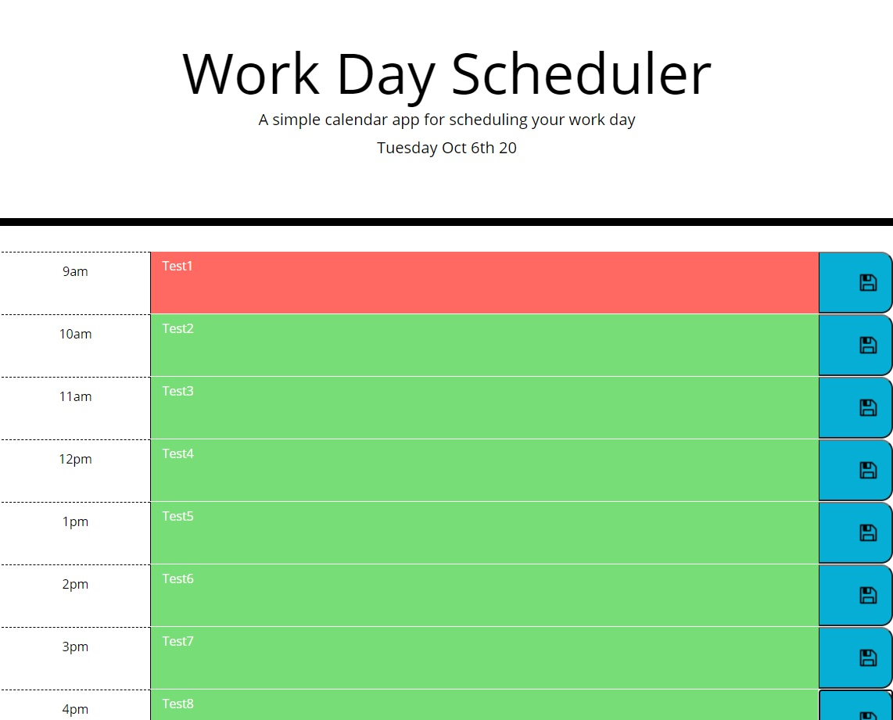

# 05 Third-Party APIs: Work Day Scheduler

## Checklist

- When opening the planner, the current day (weekday, month, day, year) is displayed at the top of the calendar
- Time blocks for 9am-5pm are displayed
- Each time block is color-coded to indicate whether it is in the past (grey), present (red), or future (green)
- User can enter an event by clicking on a time block
- User can save the text for that time block into local storage by clicking on the save button for that time block
- Saved events persist after page refresh

- App uses Moment.js library to work with date and time

## Screenshot:

## Links:

GitHub Repo: https://github.com/apnordin/05-Work-Day-Scheduler

Deployed App: https://apnordin.github.io/05-Work-Day-Scheduler/